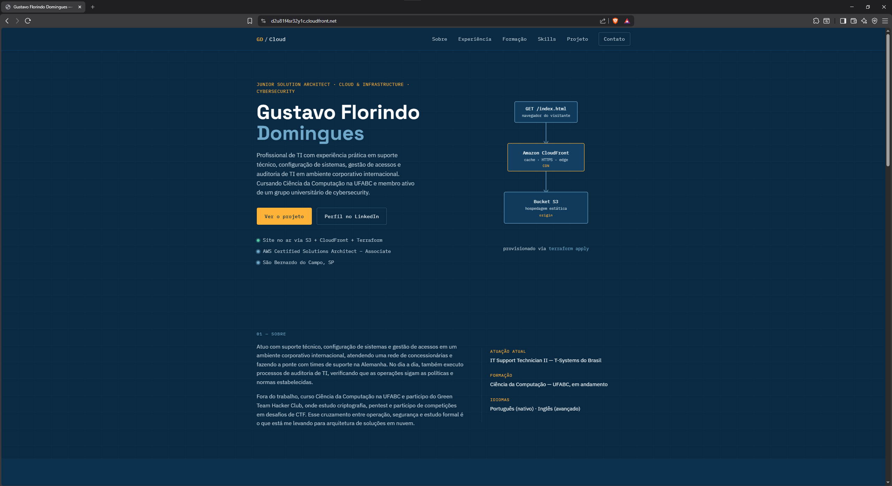

# AWS Static Website with Terraform

Este projeto demonstra o provisionamento de uma infraestrutura para hospedagem de um site estático na AWS utilizando **Terraform** como ferramenta de Infrastructure as Code (IaC).

O objetivo deste projeto foi transformar os conhecimentos adquiridos durante os estudos para a certificação **AWS Certified Solutions Architect – Associate (SAA-C03)** em experiência prática, utilizando serviços amplamente empregados em ambientes reais.

---

## Arquitetura

```
                 Internet
                     │
                 HTTPS
                     │
                     ▼
        CloudFront Distribution
                     │
             (CDN e Cache)
                     │
                     ▼
        Amazon S3 Static Website
                     │
      index.html | style.css | script.js
```



---

## Tecnologias utilizadas

- AWS S3
- AWS CloudFront
- Terraform
- HTML5
- CSS3
- JavaScript

---

## Objetivos do projeto

- Provisionar infraestrutura utilizando Terraform
- Hospedar um site estático na AWS
- Automatizar o upload dos arquivos da aplicação
- Distribuir o conteúdo através do CloudFront
- Compreender conceitos de Infrastructure as Code
- Criar um projeto de portfólio para Cloud Engineering

---

## Estrutura do projeto

```
aws-static-website-terraform/

├── terraform/
│   ├── provider.tf
│   ├── versions.tf
│   ├── main.tf
│   ├── cloudfront.tf
│   ├── outputs.tf
│   └── .gitignore
│
├── website/
│   ├── index.html
│   ├── style.css
│   └── script.js
│
├── images/
│   └── website.png
│
└── README.md
```

---

## Recursos provisionados

O Terraform cria automaticamente:

- Amazon S3 Bucket
- Static Website Hosting
- Bucket Policy
- Public Access Block Configuration
- Upload dos arquivos HTML, CSS e JavaScript
- CloudFront Distribution
- Outputs com as URLs da aplicação

---

## Conceitos praticados

Durante o desenvolvimento deste projeto foram utilizados diversos conceitos importantes de Cloud Computing e Infrastructure as Code:

### Terraform

- Providers
- Resources
- Outputs
- Terraform State
- Dependências entre recursos
- Planejamento de mudanças (`terraform plan`)
- Provisionamento (`terraform apply`)
- Destruição da infraestrutura (`terraform destroy`)

### Amazon S3

- Buckets
- Object Storage
- Static Website Hosting
- Bucket Policies
- Public Access Block
- Upload automatizado de objetos

### Amazon CloudFront

- Content Delivery Network (CDN)
- Distribuição global de conteúdo
- Cache
- Compressão automática
- Redirecionamento HTTP → HTTPS
- Origins
- Default Cache Behavior

---

## Como executar

Inicializar o projeto:

```bash
terraform init
```

Validar:

```bash
terraform validate
```

Visualizar as mudanças:

```bash
terraform plan
```

Provisionar a infraestrutura:

```bash
terraform apply
```

Remover toda a infraestrutura:

```bash
terraform destroy
```

---

## Observações

Este projeto utiliza o **Amazon S3 Static Website Endpoint** como origem do CloudFront.

Embora essa arquitetura seja adequada para fins de aprendizado e para um site estático simples, a recomendação atual da AWS para ambientes de produção é utilizar:

- Bucket S3 privado
- CloudFront
- Origin Access Control (OAC)

Essa evolução será implementada em um projeto futuro.

---

## Próximos passos

Este projeto faz parte de uma sequência de pequenos projetos que estou realizando para aplicar os conhecimentos adquiridos através das minhas certificações.

Possiveis próximas implementações:

- S3 privado utilizando Origin Access Control (OAC)
- CI/CD com GitHub Actions
- Certificado SSL com AWS Certificate Manager (ACM)
- Domínio personalizado utilizando Amazon Route 53
- Monitoramento utilizando Amazon CloudWatch

---

## Autor

Gustavo Florindo Domingues